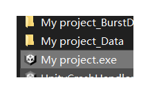
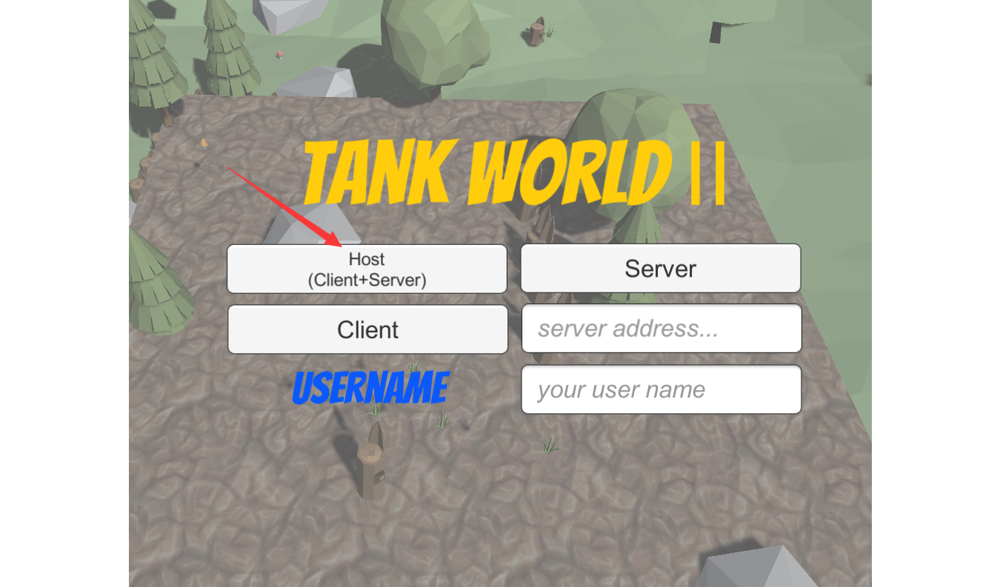
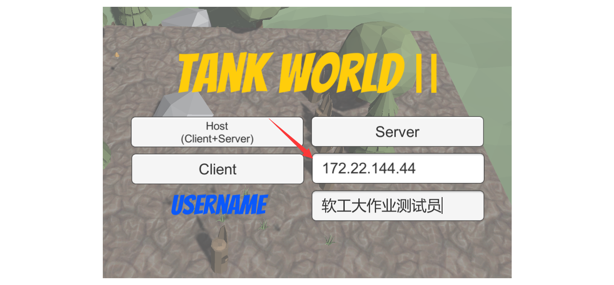
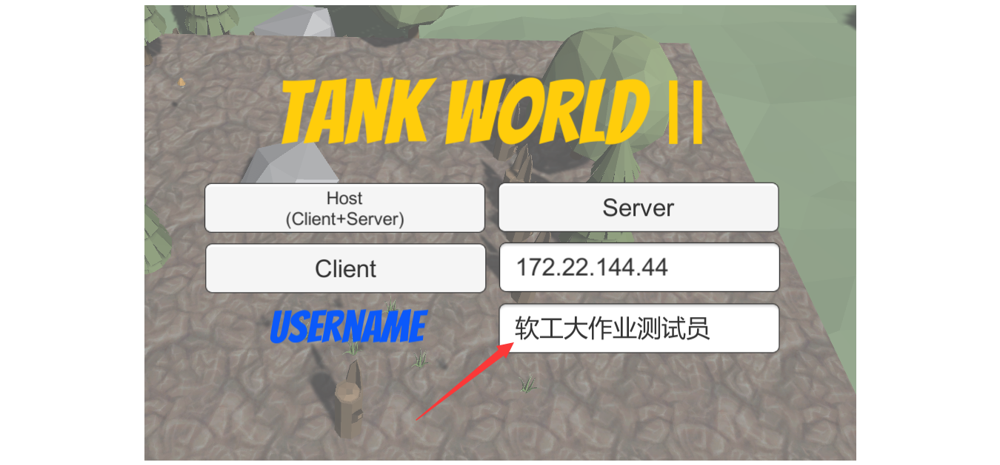
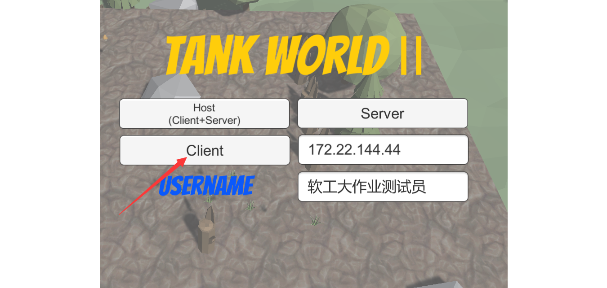
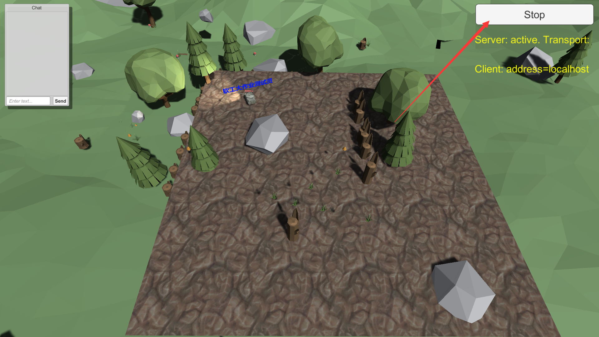
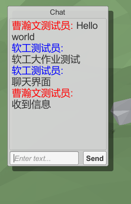
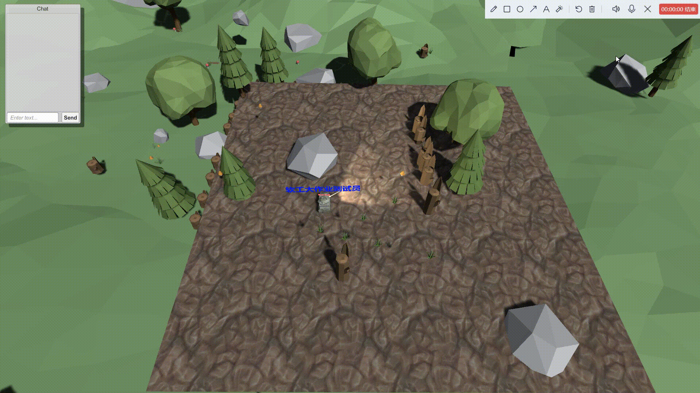
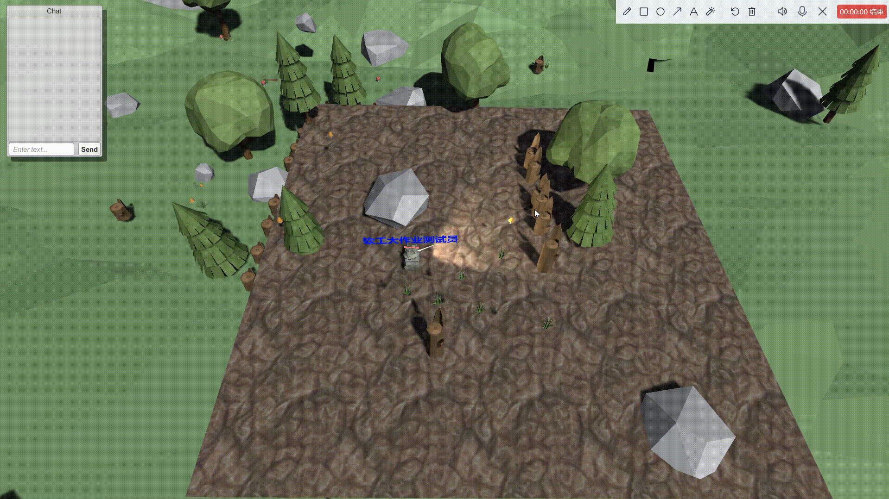
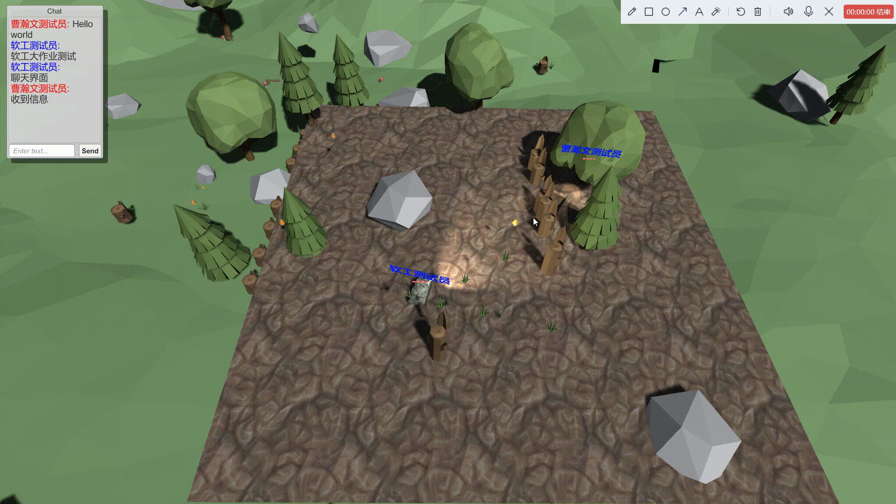

# TANK WORLD Ⅱ多人在线游戏系统 操作说明

东北大学2022年度《软件工程》课程 小组大作业

## 一、功能模块的划分
**本系统共由两模块组成**

* 在线聊天模块：
	* 本模块旨在为在线游戏用户提供实时文字交流的功能。
	* 其中针对本地用户和非本地用户能够差异性显示。
	* 可滚动查询历史聊天记录。
* 多人在线游戏模块：
	* 本模块可为多用户提供在线实时游戏对抗的功能。
	* 共由四个复活点，为每个玩家进行游戏的初始位置。
	* 玩家由鼠标、键盘组合进行射击。
	* 地图内设置有大本营（安全区）、障碍物（免伤物体），以增加玩家的游戏趣味性。
## 二、使用说明
###登陆场景

* 游戏开始
	* 运行可执行文件：My project.exe

* 主机登录

	* 点击Host(Client+Server),将本机设置为服务器

* 普通玩家登录 
	* 在Client按钮右侧输入框输入服务器IP
	
	* 在USERNAME右侧输入框输入登录用户名
	
	* 点击Client按钮进入游戏
	

###游戏场景
* 主机游戏场景
	* 点击Stop按钮关闭本机服务器
	
	* 聊天界面

* 普通玩家游戏场景
	* 键入A/↑、W/←、D/→控制坦克行进和方向
	
	* 鼠标位置控制坦克炮筒发射方向
	
	* 空格键进行发射
	
	* 被击中后血量减一，血量为另时角色被消灭
	
	
	* 障碍物及大本营免伤
	

## 三、注意事项

* 用户名作为游戏用户的唯一身份标识，同场游戏内请勿重复使用。
* 免责声明：本项目为东北大学《软件工程》课程大作业，不用于其他用途，最终解释权归本小组所有。